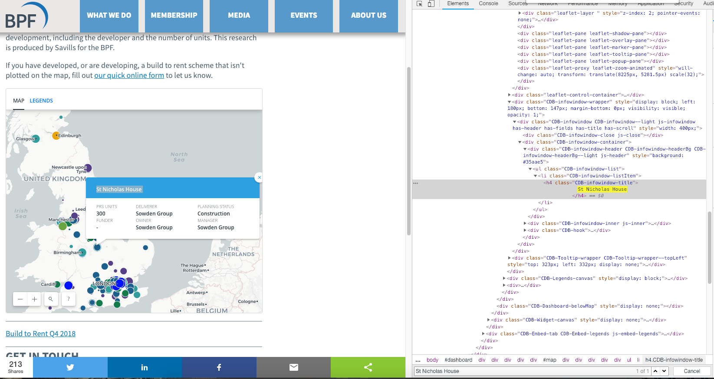

# Interactive Map Scraping 

The brief is to use the map on [this](https://www.bpf.org.uk/what-we-do/bpf-build-rent-map-uk) website to get the information about BPF build to rent statistics in the UK. Initial thoughts are to scrape the full HTML and then parse through the relevant data to find the relevant information. Using python and i will assume selenium will be involved. 

# Finding the data in the HTML

## First look


So first I select a dot then find the name of the development in the HTML, all good. Then I click another circle/ marker and search the previous house, this is to try and get a better sense of where all the data is. No luck, it seems that the information is loaded on request.

## Second look

Using [this](https://onlinejournalismblog.com/2017/05/10/how-to-find-data-behind-chart-map-using-inspector/) very helpful website I utilise the network tab in the inspect module. 

As the top right of the inspect pane shows, the page loads a file when the marker is clicked. I inspect this file to see a JSON looking file, open the link in a new tab and see it is intact a JSON of some sort. I repeat this a couple of times and find consistent results. Now to look at the web address.

```
https://cartocdn-gusc-b.global.ssl.fastly.net/savills/api/v1/map/savills@465f18a4@abe58d5bc799578ceeba1b9ab6e7945f:1539185524180/1/attributes/265?callback=_cdbi_layer_attributes_0_20
https://cartocdn-gusc-b.global.ssl.fastly.net/savills/api/v1/map/savills@465f18a4@abe58d5bc799578ceeba1b9ab6e7945f:1539185524180/1/attributes/48?callback=_cdbi_layer_attributes_0_16
https://cartocdn-gusc-b.global.ssl.fastly.net/savills/api/v1/map/savills@465f18a4@abe58d5bc799578ceeba1b9ab6e7945f:1539185524180/1/attributes/285?callback=_cdbi_layer_attributes_0_22
https://cartocdn-gusc-b.global.ssl.fastly.net/savills/api/v1/map/savills@465f18a4@abe58d5bc799578ceeba1b9ab6e7945f:1539185524180/1/attributes/528?callback=_cdbi_layer_attributes_0_21
https://cartocdn-gusc-b.global.ssl.fastly.net/savills/api/v1/map/savills@465f18a4@abe58d5bc799578ceeba1b9ab6e7945f:1539185524180/1/attributes/506?callback=_cdbi_layer_attributes_0_4
```

It may be a bit difficult to see in this view, but he web addresses are identical bar a number before call back and a layer attribute. I check again and purposefully change the layer attribute, there are no changes to the web page. This makes life a little easier as only need to change one element of the web address. 

# Selenium to scrape the data

Uses selenium to scrape all the webpage. Loops through webpages using formatted string to alter the web address and store output in a text file on a new line. I'm not sure where to start from our end at, i will do a speculative loop from 0 to 1000 and see what happens. 

**Result**: Maxed out somewhere around 568, just started returning empty JSONs but now we have  a text file with all the data, yay!! 😃

# Cleaning the JSON data

Maybe I like to make things difficult for myself, but I was thinking create a parser. An esteemed colleague suggested the excel split tool: they were correct. Less than a minute using the import external data tool and we have a clean looking dataset. We also have more features then shown on the website so that is nice.


# Finding Longitude and Latitude

Not hopeful about this one but we may as well give it a go. I'm thinking google maps api, it looks like a good route. So it is after fiddling with the api key i have successfully found the geocode google api to be exactly what we need. I create a loop to input the addresses from the csv and pass that as an argument to the google api. I write these to a new text file to keep things separate, there is definitely a more efficient way to do this. 

The python code is extremely messy, use a function to call the API, loop and append the text file. Messy stuff.

```python
def get_long_lat(address):
    try:
        # Geocoding an address
        geocode_result = gmaps.geocode(address)
        #returns a JSON type value
        result = (geocode_result[0])
        location_dict = result.get('geometry')      #get the right dictionary
        location = location_dict.get('location')
        return(location)
    except:
        return("Error")
        print(f"{address} not found")
```

Now I will do the same process, import the text file, split and merge with the other one. Im hoping the ordering remains the same. The result was fairly pleasing, not a lot of missing longitudes and latitudes. 


