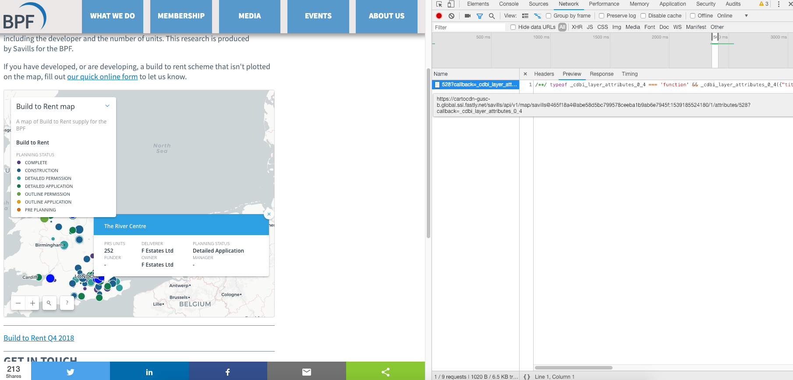

# Interactive Map Scraping 

Web-scraping can throw up lots of different data sets, but sometimes the html structure can get a bit complicated. This post provides a simple example workflow of a simple scraping project and how to create neat, alternative datasets from the web. In this example we are able to access the data held in an interactive map with a little bit of searching within the HTML script. 

The [map used](https://www.bpf.org.uk/what-we-do/bpf-build-rent-map-uk) was created by the British Property Federation and shows build-to-rent statistics in the UK. Initial thoughts are to scrape the full HTML and then parse through the all data to find the relevant information. The preferred tool of choice is [selenium using a Chrome driver](http://chromedriver.chromium.org/getting-started).

## Initial Look


Let's have a look at how the web client works. As you can see from the screenshot, clicking on a build-to-rent property will display a callout with additional details. The map is a great visual tool showing the geographic distribution of these properties, but  further analysis is hard. 

Let's search the HTML and see if we can find out something about the underlying structure. First, select a property, then find the name of the property development in the HTML, for example:  *property_1*. Then select another property marker and search for *property_1*, this is to try and get a better sense of the structure of the HTML. No luck, it seems that each specific property information is loaded on request.

## Intercepting JSON Packages

Using [this](https://onlinejournalismblog.com/2017/05/10/how-to-find-data-behind-chart-map-using-inspector/) very helpful website to utilise the network tab in the inspect module as shown below. 

As the top right of the inspect pane shows, the page loads a file when the marker is clicked. This element contains a  JSON-type file. Opening the link directly confirms this is, in fact, a JSON element.

```JSON
/**/ typeof _cdbi_layer_attributes_0_4 === 'function' && _cdbi_layer_attributes_0_4({"title":"Surrey House","prs_units":322,"deliverer_contact":"Salmon Harvester Properties","buyer_funder_contact":"Salmon Harvester Properties","manager":"-","planning_status":"Detailed Application","prs_type":"Build to rent","owner":"Salmon Harvester Properties"});
```

To get an idea of the structure, we repeat this process a few times to find consistent results. This allows us to note down the addresses.

```
https://cartocdn-gusc-b.global.ssl.fastly.net/savills/api/v1/map/savills@465f18a4@abe58d5bc799578ceeba1b9ab6e7945f:1539185524180/1/attributes/265?callback=_cdbi_layer_attributes_0_20
https://cartocdn-gusc-b.global.ssl.fastly.net/savills/api/v1/map/savills@465f18a4@abe58d5bc799578ceeba1b9ab6e7945f:1539185524180/1/attributes/48?callback=_cdbi_layer_attributes_0_16
https://cartocdn-gusc-b.global.ssl.fastly.net/savills/api/v1/map/savills@465f18a4@abe58d5bc799578ceeba1b9ab6e7945f:1539185524180/1/attributes/285?callback=_cdbi_layer_attributes_0_22
https://cartocdn-gusc-b.global.ssl.fastly.net/savills/api/v1/map/savills@465f18a4@abe58d5bc799578ceeba1b9ab6e7945f:1539185524180/1/attributes/528?callback=_cdbi_layer_attributes_0_21
https://cartocdn-gusc-b.global.ssl.fastly.net/savills/api/v1/map/savills@465f18a4@abe58d5bc799578ceeba1b9ab6e7945f:1539185524180/1/attributes/506?callback=_cdbi_layer_attributes_0_4
```

It may be a bit difficult to see in this view, but the web addresses are identical bar a number in-between the layer and call back attribute (the last digits are irrelevant). Test out this hypothesis by only changing this number, there are no changes to the web page. This makes life a little easier as we only need to change one element of the web address. 

# Selenium to scrape the data

Using Python we can set up an empty file to hold the scraped elements and define our browser element. 

```python
from selenium import webdriver
import webbrowser
import string
from io import open

text_file = open("scraped_data.txt", "w")

'''Scrapes data from interactive map.'''
#Open the website using Chrome
chromedriver = "pythoncode/chromedriver"
browser =  webdriver.Chrome(chromedriver)

```

Next, we can use a formatted string which includes a variable we'll call {prop_no} to loop through webpages. This allows us to iterate through the webpages and store output in a text file on a new line. At this moment we are unsure how many properties are not his map, a speculative loop from 0 to 1000 with a try/except block should find all properties. 

```python
#Itterate through the webpages
for property_number in range(0,1000):
    prop_no = property_number
    #Store results in a text file
    with open("scraped_data.txt", "a") as f:
        url =f"https://cartocdn-gusc-b.global.ssl.fastly.net/savills/api/v1/map/savills@465f18a4@abe58d5bc799578ceeba1b9ab6e7945f:1539185524180/1/attributes/{prop_no}?callback=_cdbi_layer_attributes_0_22"
    try:
        browser.get(url)
        results = browser.page_source
        #Only want relevant JSON, strip away the HTML
        results = results[215:-22].encode('utf-8')
        f.write(f"{results}\n")
    except:
        print(prop_no)
        break
         
```


**Result**: No more results were returned after we reached property number 568. Our script returns all of the data in a text file.

# Cleaning the JSON data

We could have used a parser to manipulate the data as it was being scraped. Instead, we now have a text file with JSON data for each property. This is easy enough to split using the the excel split tool. Less than a minute using the import external data tool and we have a clean looking dataset. We also have more features then shown on the website so that is nice.


# Further Steps

Unfortunately, our scraping has lost the longitude and latitude elements of the original web interface. An extremely useful tool provided by Google is the Google Maps API. The set up can be a bit fiddly but the documentation is really clear if you have never used it before. The [geocode Google API](https://developers.google.com/maps/documentation/geocoding/start) is exactly what we need. Create a function to take the addresses from the csv file as input, pass that as an argument to the google api and return the longitude and latitude. 

```python
def get_long_lat(address):
    try:
        # Geocoding an address
        geocode_result = gmaps.geocode(address)
        #returns a JSON type value
        result = (geocode_result[0])
        location_dict = result.get('geometry')      #get part of the return object
        location = location_dict.get('location')
        return(location)
    except:
        return("Error")
        print(f"{address} not found")
```

We then create a function to iterate through the original csv file and append the relevant longitude and latitude values. We now have a clean data set that can be used with other location specific variables or distance-related calculations. 

This project has enabled us to generate a data set from an online visualisation tool. Using the built in "inspect element" tools in our browsers, we can create aggregated the information and allow us to perform more in-depth analysis. I hope this has been a useful run through of an example web-scraping project. Any thoughts or comments please let me know!


<script>
  <div class="iactiveImg" data-ii="7505"></div><script src="https://interactive-img.com/js/include.js"></script>
</script>

